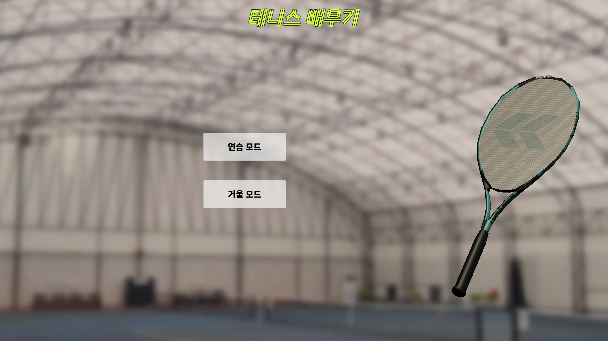
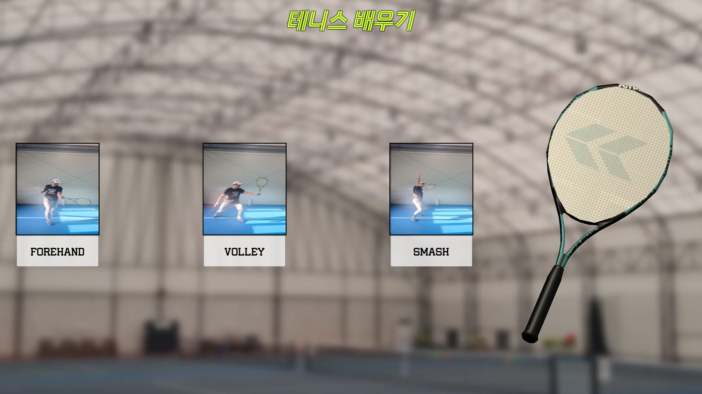
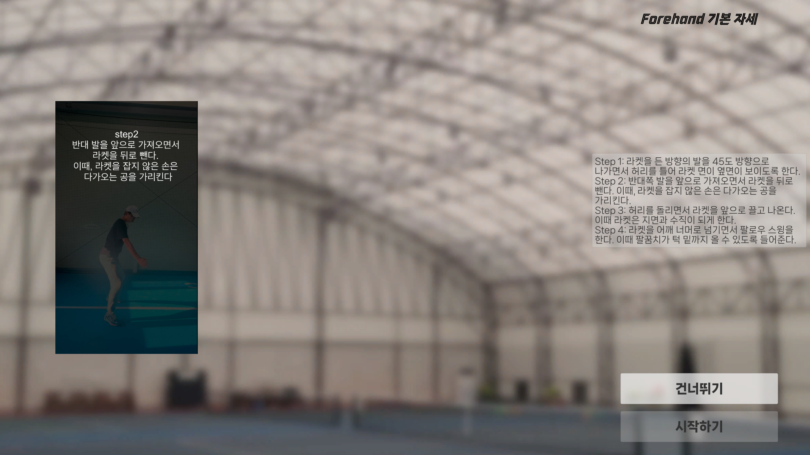
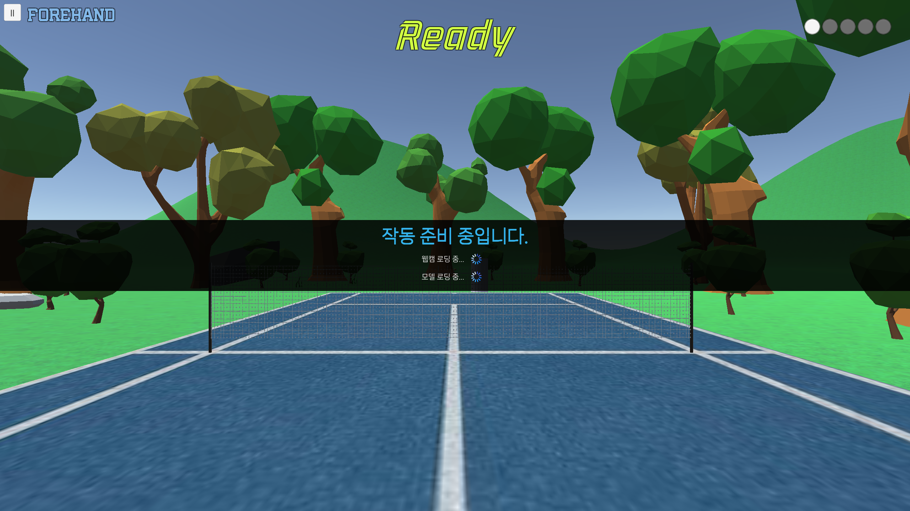
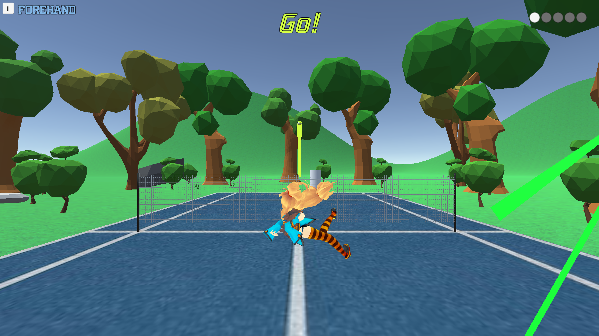

# Tennis Echo (Unity)
**테니스 에코 (유니티)** 

2023 디자인적 사고 팀프로젝트 
2023 Design Thinking Team Project

## 개요 | Outline

제작 기간(period): 2023/10/13 ~ 2023/12/23

인공지능을 이용한 테니스 :tennis: 가이드 앱 만들기 프로젝트입니다. 앱은 사용자의 움직임을 카메라(웹캠)로 감지하여 화면에 시각적으로 보여주며, 또한 테니스 공을 칠 수 있는 기능도 구현되어 있습니다. 이를 통해 사용자는 자신의 자세를 확인하고 필요한 교정을 받을 수 있습니다.
오픈소스인 [ThreeDPoseUnityBarracuda](https://github.com/digital-standard/ThreeDPoseUnityBarracuda)와 유니티를 활용하여 제작하였습니다.

This is a project to create a tennis :tennis: guide app using artificial intelligence. The app detects user movements through a camera (webcam) and visually displays them on the screen. Additionally, it features the functionality to hit tennis balls. Through this, users can check their posture and receive necessary corrections. It was developed using the open-source [ThreeDPoseUnityBarracuda](https://github.com/digital-standard/ThreeDPoseUnityBarracuda) and Unity.

## 팀 구성원 | Team member

* [Keval](https://github.com/kevalsil) 
* [Ji Hwan Park](https://github.com/DefineJH) 
* [OverWindow](https://github.com/OverWindow) 
* [hoyoon choi](https://github.com/hoyoonchoi) 

## 개발과정 | Development process

➡️[Presentation PPT](https://drive.google.com/file/d/11CmiScZ9sJiZIK8G8POVK6VpsX0rLEDj/view?usp=drive_link)⬅️
➡️[Notion](https://big-tracker-47a.notion.site/12-14-d93f476dd8ce41ffb1f5b3410525bab9?pvs=4)⬅️

이곳에서 개발 배경 및 과정을 확인할 수 있습니다!

You can find the development background and process here!

## 사용법 | How to use

### 1. 실행 | Execution

➡️[Download](https://drive.google.com/file/d/1Yshepfp8w7Dkmz_eMzL8OuOo66QUS4sp/view?usp=drive_link)⬅️

해당 링크에서 실행파일을 다운받고 압축을 해제합니다. 이후 TennisTeacher.exe 파일을 실행합니다.

Download the executable file from the provided link and extract the compressed file. Then, run the TennisTeacher.exe file.

### 2. 로비 | Lobby

 

모드를 선택할 수 있습니다.
* 연습 모드: 공이 일정한 시간마다 날아옵니다.
* 거울 모드: 초기에는 공이 자동으로 날아오나, 이후부터 자신이 쳤던 방향대로 다시 공이 날아옵니다.

Allows you to select a mode.
* 연습 모드(Practice mode): The ball flies at regular intervals.
* 거울 모드(Mirror mode): Initially, the ball flies automatically, but then it flies back in the direction it hit.

### 3. 연습 모드 | Practice mode

 
 
 
 

입장 시 3가지 자세 중 하나를 선택해 연습할 수 있습니다. 선택 시 시연 연상이 나오며, 구동 준비 이후 연습이 시작됩니다.

When entering, you can practice by selecting one of the three postures. When selected, you will be reminded of the demonstration, and practice will begin after you are ready to drive.

### 3. 거울 모드 | Mirror mode

구동 방법은 연습 모드와 동일합니다.

The driving method is the same as the Practice mode.

## 기타자료 | Other data

  
Source code

  GameManager.cs: 게임 전체를 관리합니다. 
  LobbyManager.cs: 로비씬을 관리합니다. 
  RotateRacket.cs: 3d 테니스 라켓 오브젝트를 돌립니다. 
  PracticeManager.cs: 연습씬을 관리합니다. 
  BallShooter.cs: 공을 발사합니다. (현진님 브랜치, 약간 수정) 
  Ball.cs: 공의 타격 판정을 관리합니다. 공 오브젝트에 부착합니다. 
  TrailRenderer.cs: 공의 궤적을 그립니다. 공 오브젝트에 부착합니다. 
  RoundUIManager.cs: 라운드 UI를 그립니다. 

